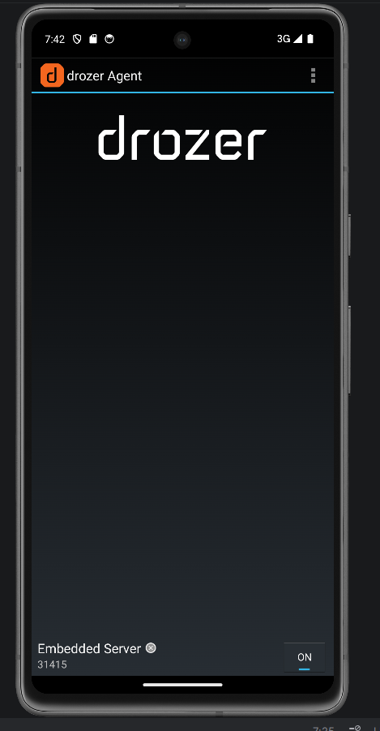
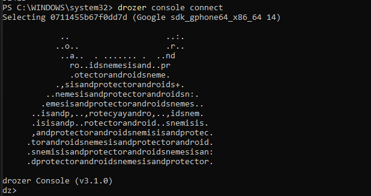
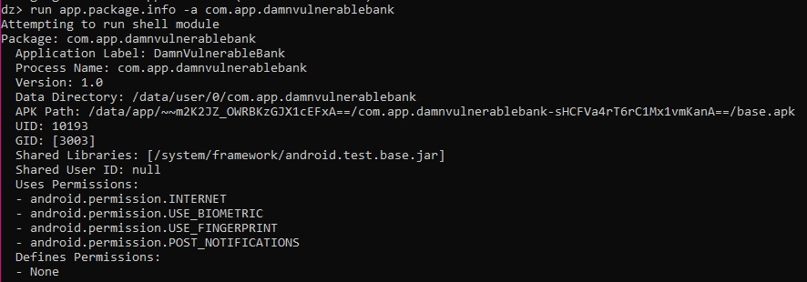
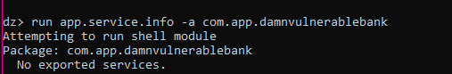
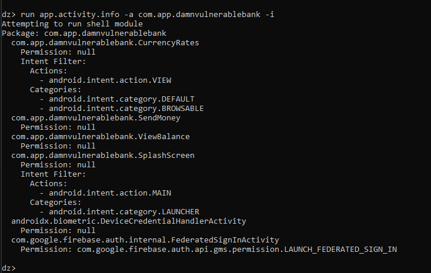
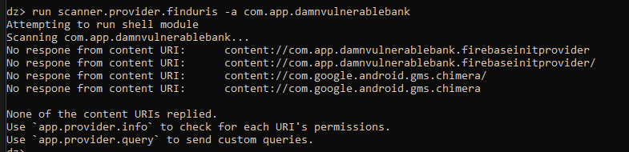

# LAB 9 – Analyse de surface d'attaque Android avec Drozer

> **Cours** : Sécurité des applications mobiles  
> **Type** : Audit défensif en environnement autorisé  
> **Outil** : Drozer 3.1.0 | **Standard** : OWASP MASVS/MASTG

---

## Informations générales

| Champ | Valeur |
|-------|--------|
| **Application** | DamnVulnerableBank |
| **Package** | `com.app.damnvulnerablebank` |
| **Version** | 1.0 |
| **Outil** | Drozer 3.1.0 |
| **Émulateur** | Android API 34 (Google Pixel) |
| **Standard** | OWASP MASVS / MASTG |

---

## Objectifs pédagogiques

- Maîtriser l'utilisation de Drozer pour l'analyse de sécurité Android
- Identifier les composants Android exposés et leurs vulnérabilités
- Évaluer les risques liés aux composants mal configurés
- Documenter méthodiquement les résultats d'un audit de sécurité
- Proposer des remédiations conformes aux standards OWASP MASVS

---

## Architecture du lab

```
PC Hôte (Drozer Console)
        │
        │  ADB (tcp:31415)
        ▼
Émulateur Android
        │
        ▼
DamnVulnerableBank.apk + Agent Drozer
```

---

## Étape 1 – Configuration de l'environnement

```bash
adb install drozer-agent.apk
adb install dvba.apk
adb forward tcp:31415 tcp:31415
```

Activation du serveur Drozer Agent sur l'émulateur :



---

## Étape 2 – Connexion et validation

```bash
drozer console connect
```



---

## Étape 3 – Cartographie des composants exposés

```bash
dz> run app.package.info -a com.app.damnvulnerablebank
dz> run app.activity.info -a com.app.damnvulnerablebank
dz> run app.service.info -a com.app.damnvulnerablebank
dz> run app.broadcast.info -a com.app.damnvulnerablebank
dz> run app.provider.info -a com.app.damnvulnerablebank
```






### Tableau récapitulatif des composants

| Type | Composant | Exporté | Permission | Risque |
|------|-----------|---------|------------|--------|
| Activity | `CurrencyRates` | ✅ Oui | ❌ Aucune | Élevé |
| Activity | `SendMoney` | ✅ Oui | ❌ Aucune | **Critique** |
| Activity | `ViewBalance` | ✅ Oui | ❌ Aucune | **Critique** |
| Activity | `SplashScreen` | ✅ Oui | ❌ Aucune | Faible |
| Service | — | ❌ Non | — | — |
| Receiver | — | ❌ Non | — | — |
| Provider | — | ❌ Non | — | — |

---

## Étape 4 – Vérification des protections

```bash
dz> run app.activity.info -a com.app.damnvulnerablebank -i
```



**Résultats :**
- `CurrencyRates` : intent-filter `VIEW` + `BROWSABLE` sans permission → accessible depuis le navigateur
- `SendMoney` : exportée sans aucune protection
- `ViewBalance` : exportée sans aucune protection

---

## Étape 5 – Analyse des risques

| Composant | Risque | Scénario d'abus |
|-----------|--------|-----------------|
| `SendMoney` | Transfert d'argent non autorisé | Intent direct depuis une app tierce |
| `ViewBalance` | Accès au solde sans authentification | Intent direct contournant le login |
| `CurrencyRates` | Accessible via lien web | URL malveillante via navigateur |
| `SplashScreen` | Faible | Launcher normal |

---

## Étape 6 – Collecte de preuves

```bash
dz> run scanner.provider.finduris -a com.app.damnvulnerablebank
```



---

## Résumé exécutif

L'application `DamnVulnerableBank` expose **4 activities sans protection adéquate**. Les activités `SendMoney` et `ViewBalance` sont particulièrement critiques car elles permettent d'accéder à des fonctionnalités bancaires sensibles sans aucune authentification, simplement en envoyant un intent explicite depuis n'importe quelle application tierce.

**Score de sécurité estimé : 35/100**

| Sévérité | Nombre |
|----------|--------|
| 🔴 Critique | 2 |
| 🟠 Élevée | 1 |
| 🔵 Faible | 1 |

---

## Triage des vulnérabilités

| ID | Composant | Vulnérabilité | Sévérité | Recommandation | Statut |
|----|-----------|---------------|----------|----------------|--------|
| V1 | `SendMoney` | Exportée sans permission | Critique | `exported=false` | À corriger |
| V2 | `ViewBalance` | Exportée sans permission | Critique | `exported=false` | À corriger |
| V3 | `CurrencyRates` | Intent BROWSABLE sans protection | Élevée | Ajouter permission | À corriger |
| V4 | `SplashScreen` | Exportée (launcher) | Faible | Normal | Accepté |

---

## Mapping OWASP MASVS

| ID | Vulnérabilité | Référence MASVS | Description |
|----|---------------|-----------------|-------------|
| V1 | Activities exportées sans protection | MSTG-PLATFORM-1 | Ne pas exposer les composants inutilement |
| V2 | Accès fonctions sensibles sans auth | MSTG-AUTH-1 | Authentification robuste requise |
| V3 | Intent-filter BROWSABLE non protégé | MSTG-PLATFORM-2 | Valider les entrées externes |

---

## Remédiations

### 1. Désactiver l'export des activities sensibles

```xml
<!-- AndroidManifest.xml -->
<activity
    android:name=".SendMoney"
    android:exported="false" />

<activity
    android:name=".ViewBalance"
    android:exported="false" />
```

### 2. Protéger CurrencyRates avec une permission

```xml
<activity
    android:name=".CurrencyRates"
    android:exported="true"
    android:permission="com.app.damnvulnerablebank.permission.VIEW_RATES">
    <intent-filter>
        <action android:name="android.intent.action.VIEW" />
        <category android:name="android.intent.category.BROWSABLE" />
    </intent-filter>
</activity>
```

### 3. Déclarer la permission avec niveau signature

```xml
<permission
    android:name="com.app.damnvulnerablebank.permission.VIEW_RATES"
    android:protectionLevel="signature" />
```

---

> ⚠️ **Cadre légal** : Audit réalisé en environnement contrôlé sur émulateur. Aucune donnée réelle manipulée. Toutes les analyses sont strictement défensives.
